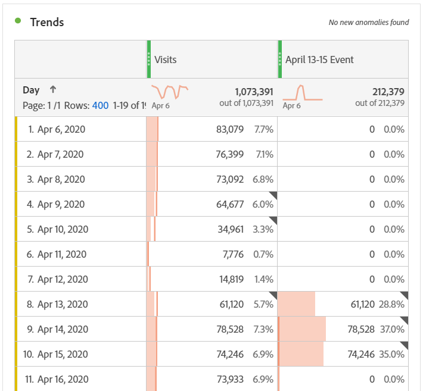

# De invloed van gebeurtenissen doorgeven aan gebruikers

Als u gegevens hebt [beïnvloed door een gebeurtenis](overview.md), is het belangrijk om die gebeurtenis aan gebruikers in uw organisatie mee te delen.

* Ontwikkel een gemeenschappelijke ontkenning die u in mededelingen voor consistentie kunt gebruiken
* Doorlopende communicatie bieden aan gebruikers van Analytics en belangrijke belanghebbenden tijdens en na de gebeurtenis
* Plaats een kalenderherinnering voor volgende mijlpalen, zoals de volgende maand of het volgende jaar. Deze mededeling helpt gebruikers die rapporten bekijken in de toekomst herinneren aan de gevolgen in maand-over-maand of jaar-over-jaar rapporten.

In Adobe Analytics worden in de volgende secties verschillende manieren getoond waarop u kunt communiceren met gebruikers in uw organisatie. U kunt ook andere methoden buiten Adobe Analytics gebruiken, zoals e-mail, om te communiceren met gebruikers.

## Communiceren via het deelvenster of visualisatiebeschrijvingen

Als u een Werkruimteproject hebt dat onder gebruikers in uw organisatie wordt gedeeld, kunt u het effect van een gebeurtenis door paneel of visualisatiebeschrijvingen meedelen. Klik met de rechtermuisknop op een deelvenster of visualisatiekop en selecteer vervolgens **[!UICONTROL Edit description]**.

## Communiceren via tekstvisualisatie

U kunt het effect van een gebeurtenis ook communiceren via speciale tekstvisualisaties. Zie [Tekstvisualisaties](/help/analyze/analysis-workspace/visualizations/text.md) in de gebruikershandleiding Analyseren.

## Aangepaste kalendergebeurtenissen toevoegen aan trends in Workspace

Voor elke trendvisualisatie in Workspace, kunt u in een reeks toevoegen die uw beïnvloede datumwaaier vertegenwoordigt.

1. Creeer berekende metrisch met het &quot;Betrokken dagsegment door te volgen [Specifieke data in de analyse uitsluiten](segments.md).
1. Voeg de gewenste metrische waarde toe aan het berekende metrische canvas.

   

1. Voeg een titel en een beschrijving toe om gebruikers op de hoogte te brengen van de gevolgen. U kunt deze metrische waarde desgewenst ook labelen als een kalenderannotatie.

   

1. Voeg in een vrije-vormlijst de dimensie &#39;Dag&#39; toe. Voeg &#39;Bezoeken&#39; toe en de berekende metrische waarde als kolommen naast elkaar.

   

1. Klik op het tandwielpictogram voor de kolominstellingen voor de berekende meting en schakel **[!UICONTROL Interpret zero as no value]**.

   

1. Voeg een lijnvisualisatie toe. Betrokken dagen worden weergegeven met een andere kleur. Gebruikers kunnen ook op het pictogram &#39;Info&#39; in de berekende maatstaf klikken voor meer informatie.

   

