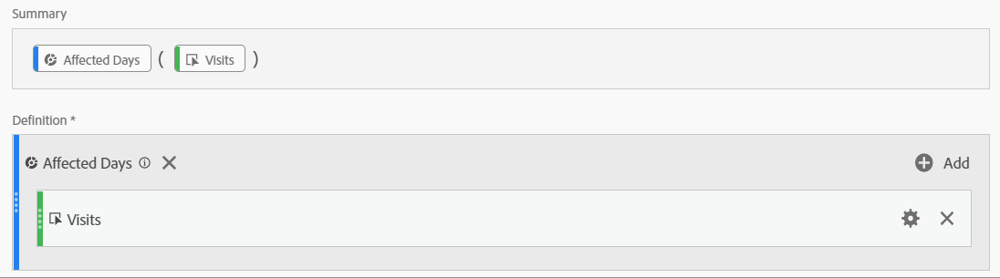
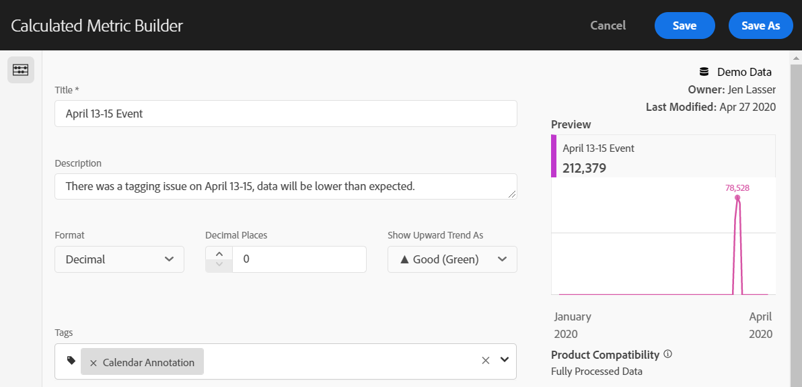
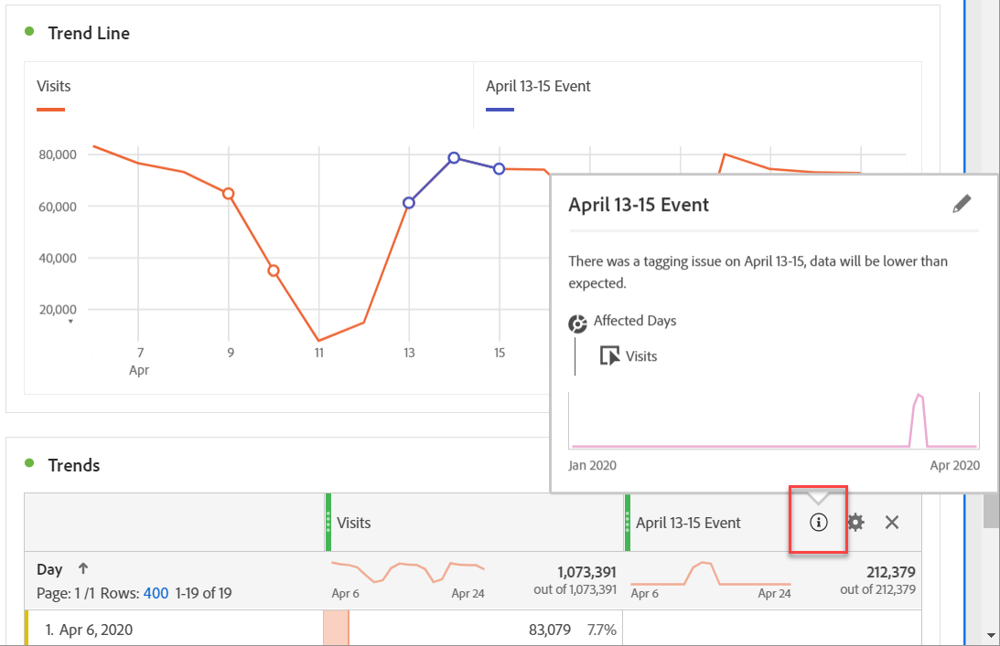

# Communiceren met gevolgen voor gebruikers

Als u gegevens hebt [die door een gebeurtenis](../event-impacted.md)worden beïnvloed, is het belangrijk om die gebeurtenis aan gebruikers in uw organisatie mee te delen.

* Ontwikkel een gemeenschappelijke ontkenning die u in mededelingen voor consistentie kunt gebruiken
* Doorlopende communicatie bieden aan gebruikers van Analytics en belangrijke belanghebbenden tijdens en na de gebeurtenis
* Plaats een kalenderherinnering voor volgende mijlpalen, zoals de volgende maand of het volgende jaar. Deze mededeling helpt gebruikers die rapporten bekijken in de toekomst herinneren aan de gevolgen in maand-over-maand of jaar-over-jaar rapporten.

In de volgende secties van Adobe Analytics worden verschillende manieren weergegeven waarop u kunt communiceren met gebruikers in uw organisatie. U kunt ook andere methoden gebruiken dan Adobe Analytics, zoals e-mail, om te communiceren met gebruikers.

## Communiceren via het deelvenster of visualisatiebeschrijvingen

Als u een Werkruimteproject hebt dat onder gebruikers in uw organisatie wordt gedeeld, kunt u het effect van een gebeurtenis door paneel of visualisatiebeschrijvingen meedelen. Klik met de rechtermuisknop op een deelvenster of visualisatiekoptekst en selecteer **[!UICONTROL Edit description]**.

## Communiceren via tekstvisualisatie

U kunt het effect van een gebeurtenis ook communiceren via speciale tekstvisualisaties. Zie [Tekstvisualisaties](/help/analyze/analysis-workspace/visualizations/text.md) in de gebruikershandleiding Analyseren.

## Aangepaste kalendergebeurtenissen toevoegen aan trends in Workspace

Voor elke trendvisualisatie in Workspace, kunt u in een reeks toevoegen die uw beïnvloede datumwaaier vertegenwoordigt.

1. Maak een berekende metrische waarde met het segment &#39;Betrokken dagen&#39; door in de analyse [specifieke datums](/help/components/c-segmentation/use-cases/exclude-date-range.md)uitsluiten te volgen.
1. Voeg de gewenste metrische waarde toe aan het berekende metrische canvas.

   

1. Voeg een titel en een beschrijving toe om gebruikers op de hoogte te brengen van de gevolgen. U kunt deze metrische waarde desgewenst ook labelen als een kalenderannotatie.

   

1. Voeg in een vrije-vormlijst de dimensie &#39;Dag&#39; toe. Voeg &#39;Bezoeken&#39; toe en de berekende maateenheid als kolommen naast elkaar.

   

1. Klik op het tandwielpictogram voor de kolominstellingen voor de berekende metrische waarde en schakel deze optie in **[!UICONTROL Interpret zero as no value]**.

   

1. Voeg een lijnvisualisatie toe. Betrokken dagen worden weergegeven met een andere kleur. Gebruikers kunnen ook op het pictogram &#39;Info&#39; in de berekende maatstaf klikken voor meer informatie.

   

## Een agendagebeurtenis gebruiken in Rapporten en Analyses

Als u Rapporten &amp; Analytics gebruikt, kunt u een [kalendergebeurtenis](/help/components/t-calendar-event.md) gebruiken om beïnvloede dagen in om het even welk verlengd rapport te benadrukken. Deze methode is niet van toepassing op de werkruimte Analyse.

1. Ga naar **[!UICONTROL Components]** > **[!UICONTROL Calendar events]**.
2. Voer de gewenste titel, het gewenste datumbereik en de notitietekst in.
3. Klik op **[!UICONTROL Save]**.

