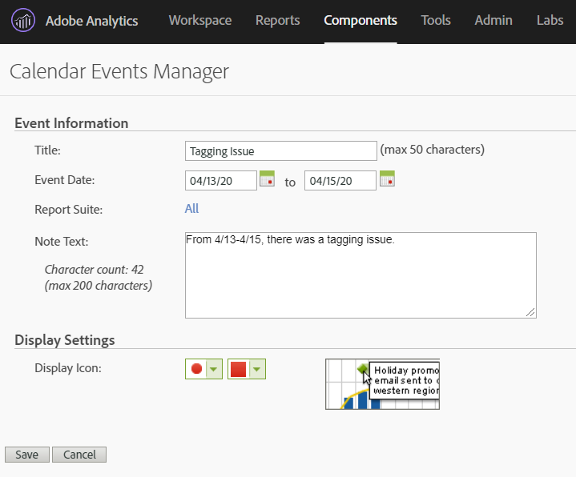

# Communiceren met gevolgen voor gebruikers

Als u gegevens hebt [die door een gebeurtenis](../event-impacted.md)worden beïnvloed, is het belangrijk om die gebeurtenis aan gebruikers in uw organisatie mee te delen. In de volgende secties ziet u verschillende manieren om te communiceren met gebruikers in uw organisatie.

## Communiceren via het deelvenster of visualisatiebeschrijvingen

Als u een Werkruimteproject hebt dat onder gebruikers in uw organisatie wordt gedeeld, kunt u het effect van een gebeurtenis door paneel of visualisatiebeschrijvingen meedelen. Klik met de rechtermuisknop op een deelvenster of visualisatiekoptekst en selecteer **[!UICONTROL Edit description]**.

## Communiceren via tekstvisualisatie

U kunt het effect van een gebeurtenis ook communiceren via speciale tekstvisualisaties. Zie [Tekstvisualisaties](/help/analyze/analysis-workspace/visualizations/text.md) in de gebruikershandleiding Analyseren.

## Een agendagebeurtenis gebruiken in Rapporten en Analyses

Als u Rapporten &amp; Analytics gebruikt, kunt u een [kalendergebeurtenis](/help/components/t-calendar-event.md) gebruiken om beïnvloede dagen in om het even welk verlengd rapport te benadrukken. Deze methode is niet van toepassing op de werkruimte Analyse.

1. Ga naar **[!UICONTROL Components]** > **[!UICONTROL Calendar events]**.
2. Voer de gewenste titel, het gewenste datumbereik en de notitietekst in.
3. Klik op **[!UICONTROL Save]**.

