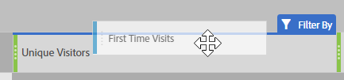

# Algemeen gebruikte metriek op andere platforms vertaalgids

Op andere platforms, zoals Google Analytics, delen veel rapporten een gemeenschappelijk aantal metriek. Gebruik deze pagina om te begrijpen hoe te om de metriek te ontspannen die in vele rapporten wordt gebruikt.

Als u meerdere metriek wilt toevoegen aan een tabel in vrije vorm voor een werkruimte, sleept u de metrische waarde uit het gebied met componenten naast de metrische koptekst in de werkruimte:

## Verwervingsgegevens

**Gebruikers** is ongeveer gelijk aan **Unieke Bezoekers** in Workspace. Zie [ Unieke bezoekers ](/help/components/metrics/unique-visitors.md) metrisch in de gebruikersgids van Componenten voor extra details.

**de Nieuwe Gebruikers** kunnen door het volgende worden verkregen:

1. Sleep **Unieke bezoekers** metrisch op de werkruimte.
2. Sleep het **Eerste segment van Bezoek** boven de Unieke metrische kopballen van Bezoekers:

   

**Sessies** is ongeveer gelijk aan **bezoeken** in Analysis Workspace. Zie [ bezoeken ](/help/components/metrics/visits.md) metrisch in de gebruikersgids van Componenten voor extra details.

## Gedragmetriek

**Bounce Tarief** is gemakkelijk beschikbaar in Analysis Workspace als metrisch. Zie het [ Stuitpercentage ](/help/components/metrics/bounce-rate.md) metrisch in de gebruikersgids van Componenten voor extra informatie.

**Pagina&#39;s/Zitting** is berekende metrisch. Het kan worden verkregen door:

1. Als u deze berekende metrische waarde al hebt gemaakt, zoekt u deze onder Metrisch en sleept u deze naar de werkruimte.
2. Als u dit berekende metrisch nog niet hebt gecreeerd, klik het **+** pictogram dichtbij de metrische lijst om Berekende Metrische Bouwer te openen.
3. Geef deze de titel &#39;Paginaweergaven per bezoek&#39; en desgewenst een beschrijving.
4. Stel de indeling in op Decimaal en stel het aantal decimalen in op 2.
5. Sleep de **metrische meningen van de Pagina** en **bezoeken** metrisch in het definitiegebied.
6. Rangschik de definitie zodat is de formule **Weergaven van de Pagina die door Bebezoeken** worden verdeeld.

   

7. Klik op Opslaan om terug te gaan naar uw werkruimte.
8. Sleep de nieuw gedefinieerde berekende metrische waarde naar de werkruimte.

   Leer meer over [ Berekende Metriek ](/help/components/calculated-metrics/cm-overview.md) in de de gebruikersgids van Componenten.

**Avg. De Duur van de zitting** is ongeveer gelijk aan **Tijd die per Bezoek (seconden) wordt uitgegeven**. Leer meer over [ bestede Tijd per bezoek ](/help/components/metrics/time-spent-per-visit.md) metriek in de gebruikersgids van Componenten.

## Omzettingscijfers

**het Tarief van de Omzetting van het Goal**, **Goal Voltooiingen**, en **Goal Waarde** vereisen extra implementatie op beide platforms. Als uw implementatie al ruimte biedt voor de productdimensie en de aankoopgebeurtenis, kunt u de volgende stappen uitvoeren:

1. Sleep de **metrische orde 0},** Metrisch van de Opbrengst **, en** Visit **metrisch op de werkruimte.**
1. Creeer berekende metrisch van **Orden per Bezoek**. Gebruik Ctrl+klikken (Windows) of cmd+klikken (Mac) op beide metrische koppen om deze te markeren. Klik één van de kopballen met de rechtermuisknop aan, selecteer **Metrisch van Selectie** creëren, dan klik **verdelen**. Deze nieuwe metrische waarde is gelijkaardig aan een Tarief van de Omzetting van het Doel.
1. Als decimalen nodig zijn, bewerkt u de Berekende metrisch. Klik op de knop Info in de metrische kop en vervolgens op het potloodpictogram. Voeg 1 of 2 Decimale Plaatsen in het Berekende Metrische venster van de Bouwer toe, dan klik sparen.

   

Als uw implementatie nog geen product- of conversiegegevens bevat, raadt Adobe aan om samen te werken met een implementatieconsultant om de kwaliteit en integriteit van de gegevens te garanderen.
