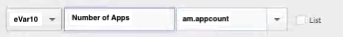

# De verwerkingsregels voor mobiele services migreren naar Adobe Analytics

In dit document vindt u instructies voor het migreren van extra verwerkingsregels - naast Levenscyclusmetriek - die u in de gebruikersinterface voor mobiele services hebt gemaakt naar Adobe Analytics.

De verwerkingsregels worden gebruikt om waarden van de variabelen van contextgegevens naar steunen en eVars te bewegen. U kunt bijvoorbeeld de waarde van een contextgegevensvariabele voor de zoekterm in de waarde van een eVar Handelsvariabele plaatsen en die waarde bij elke hit overschrijven. Zonder verwerkingsregels hebben contextgegevensvariabelen geen betekenis en vullen ze geen rapporten in Analytics.

In dit document wordt ook uitgelegd hoe u in Analysis Workspace melding kunt maken van mobiel gebruik.

## Verwerkingsregels migreren

Als u mobiele services gebruikt voor aanvullende functionaliteit, zoals verwerkingsregels en rapportfuncties voor gebruik, kunt u naadloos overschakelen naar de interface Analytics (verwerkingsregels UI of Analysis Workspace) om deze functies uit te voeren. Voor Metriek van de Levenscyclus, of regels die opstelling in de UI van de verwerkingsregels van aa waren, moet u geen migratie doen. Levenscyclusstatistieken zijn &#39;out-of-box&#39;-meetgegevens die automatisch worden verzameld wanneer de Mobile SDK voor het eerst wordt geïmplementeerd in uw app.

Nochtans, als u om het even welke extra verwerkingsregels in Mobiele Diensten UI (voorbij de Metriek van de Levenscyclus) plaatst, zou u die over moeten migreren zodat u hen in Analytics kunt uitgeven/schrappen nadat u toegang tot de Mobiele Diensten verliest.

1. Aanmelden bij `experience.adobe.com` en ga naar Mobiele services.
1. Klik op het tandwielpictogram van een mobiele app waarvan u contextvariabele toewijzingen naar Adobe Analytics wilt migreren.
1. Klik op de knop **[!UICONTROL Manage Variables and Metrics]** menu-item en klik vervolgens op **[!UICONTROL Custom Variables]** tab. Hier, kunt u zien welke de veranderlijke afbeeldingen van de Context (contextgegevens) aan de configuratie zijn toegevoegd. Noteer deze configuraties (of neem een schermafbeelding). Voorbeeld:

   

1. Schakel in Experience Cloud over naar Adobe Analytics en zorg ervoor dat u zich in dezelfde mobiele rapportsuite bevindt als u in Mobile Services hebt bekeken.
1. Ga naar **[!UICONTROL Admin]** > **[!UICONTROL Report Suites]** > **[!UICONTROL Edit Settings]** > **[!UICONTROL General]** > **[!UICONTROL Processing Rules]**.
1. Klik op **[!UICONTROL Add Rule]**.
1. Negeer de voorwaarden en ga verder om dezelfde contextvariabele(s) toe te voegen die/s in Mobiele diensten bestaan.

   

1. Klik op **[!UICONTROL Save]**.

## Melding van mobiel gebruik in Analysis Workspace

Naast mobiele metriek en dimensies (als de rapportsuite is ingeschakeld voor Mobiele services), bevat Analysis Workspace verschillende sjablonen voor mobiele projecten die de analyse kunnen vergemakkelijken:

* **[!UICONTROL Messaging]**: Richt zich op in-app en duw overseinenprestaties.
* **[!UICONTROL Location]**: Bevat een Kaart met locatiegegevens.
* **[!UICONTROL Key Metrics]**: Houd een impuls op de belangrijkste metriek van uw app.
* **[!UICONTROL App Usage]**: Hoeveel gebruikers van apps, lanceert, en lanceert eerst app had, en wat was de gemiddelde zittingslengte?
* **[!UICONTROL Acquisition]**: Hoe kunnen koppelingen voor mobiele aankopen worden uitgevoerd?
* **[!UICONTROL Performance]**: Hoe presteert de app en waar hebben gebruikers problemen?
* **[!UICONTROL Retention]**: Wie zijn mijn loyale gebruikers en wat doen ze?
* **[!UICONTROL Journeys]**: Wat zijn de opvallende gebruikspatronen voor mijn app?

Hier volgt een fragment van de Mobile App Usage-sjabloon:

De sjablonen openen:

1. Aanmelden bij `experience.adobe.com` en selecteert u Analytics.
1. Zorg ervoor dat u zich in een rapportsuite bevindt die is ingeschakeld voor Mobiele services.
1. Klik op de knop **[!UICONTROL Workspace]** tab.
1. Klik op **[!UICONTROL Create New Project]**.
1. Selecteer een van de mobiele sjablonen en klik op **[!UICONTROL Create]**.

## Andere functionaliteit voor mobiele services migreren

De volgende functionaliteit voor mobiele services heeft ook banden met Adobe Analytics, maar vereist een aangeschafte Adobe Analytics SKU:

* Verwervingskoppelingen
* Push Messaging
* In-app-berichten
* Beheer van locatiepunten

Als u mobiele services gebruikt voor betaalde functionaliteit, hebt u geen levensvatbaar migratiepad naar andere interne of externe tools:

* Voor de Verbindingen van de Aankoop, kunnen wij u aan de Partners van Adobe richten om aan uw behoefte te voldoen.
* Push Messaging en In-app Messaging zijn beschikbaar in Adobe Campaign Standard en Adobe Campaign Classic (alleen Push). De onderliggende gegevensset die voor het bepalen van de focus wordt gebruikt, is echter anders. We raden u aan om samen met uw Adobe-accountteam migratieopties voor berichtengegevens te bepalen.
* Voor de functie Locatie wordt u aangeraden het nieuwe [Adobe Experience Platform-locatieservice](https://www.adobe.com/experience-platform/location-service.html), dat gratis is voor alle Adobe Experience Platform-klanten.
