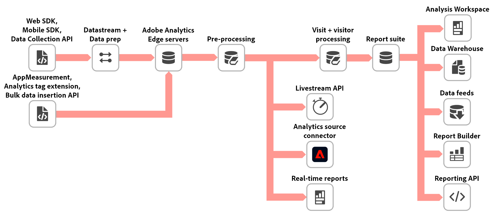

# Verwerkingsvolgorde voor gegevens in Adobe Analytics

Adobe biedt verschillende manieren om gegevens te wijzigen of te bewerken voordat deze in de rapportage worden weergegeven. Op deze pagina ziet u de volgorde waarin verschillende Adobe Analytics-functies gegevens verwerken. U kunt deze lijst gebruiken om gegevensinconsistenties problemen op te lossen, of de beste eigenschap bepalen om te gebruiken wanneer de gegevensaanpassingen noodzakelijk zijn.

## Gegevens voordat deze naar Adobe worden verzonden

Voordat gegevens naar Adobe worden verzonden, worden deze doorgaans op de client gecompileerd met een van de volgende methoden:

* **AppMeasurement**: Een dossier van JavaScript dat op uw plaats wordt ontvangen en op elke pagina van verwijzingen wordt voorzien. Gegevens worden rechtstreeks naar Adobe Analytics verzonden.
* **SDK van het Web van Adobe Experience Platform**: Een dossier van JavaScript dat op uw plaats wordt ontvangen en op elke pagina van verwijzingen voorzien. De gegevens worden naar de Adobe Experience Platform Edge Network verzonden.
* **Markeringen in de Inzameling van Gegevens van Adobe Experience Platform**: Een dossier van JavaScript dat op elke pagina van verwijzingen wordt voorzien, die regels bevatten die binnen UI van de Inzameling van Gegevens worden gecreeerd. De Adobe Analytics-extensie biedt een eenvoudigere manier om AppMeasurement te implementeren. De extensie Web SDK biedt een eenvoudigere manier om de Web SDK te implementeren.
* **API**: Zowel AppMeasurement als Edge Network bieden programmatic methodes aan om gegevens naar Adobe te verzenden. AppMeasurement biedt de [ Invoeging API van Gegevens ](https://developer.adobe.com/analytics-apis/docs/1.4/guides/data-insertion/) en de [ Bulk API van de Invoeging van Gegevens ](https://developer.adobe.com/analytics-apis/docs/2.0/guides/endpoints/bulk-data-insertion/) aan; Edge Network biedt de [ inzameling API van Gegevens ](https://developer.adobe.com/data-collection-apis/docs/) aan.

Als u gegevens naar de Edge Network verzendt, kunt u deze zo configureren dat gegevens naar Adobe Analytics (en vele andere Adobe Experience Cloud-oplossingen) worden doorgestuurd. Ongeacht de implementatiemethode komen de verzamelde raakgegevens uiteindelijk naar Adobe Analytics-verwerkingsservers in een indeling die ze kunnen parseren.

## Voorbewerking in Adobe Analytics-collectie

Wanneer gegevens naar Adobe Analytics worden verzonden, wordt een pre-verwerkingsfase gestart:

1. [**Dynamische variabelen**](/help/implement/vars/page-vars/dynamic-variables.md): Als een dynamische variabele in om het even welk deel van een beeldverzoek wordt gezien, wordt de waarde gekopieerd over en behandeld als onafhankelijke waarde die zich voorwaarts beweegt.
1. [**IP obfuscation (laatste octet)**](/help/admin/tools/manage-rs/edit-settings/general/general-acct-settings-admin.md): Als uw rapportreeks wordt gevormd om slechts de laatste octet te verduisteren, die verduistering hier van toepassing is. Merk op dat IP de opschudding (verwijder IP) later in de verwerkingspijpleiding gebeurt.
1. **Lookup lijsten**: Afmetingen die op Adobe-interne raadplegingslijsten (bijvoorbeeld, de [ Browser ](/help/components/dimensions/browser.md) dimensie) vertrouwen worden aangepast aan zijn overeenkomstige waarde.
1. [**IP uitsluiting**](/help/admin/tools/exclude-ip.md): Om het even welke IP adressen die u uitdrukkelijk van het melden uitsluiten worden gemarkeerd tijdens deze stap.
1. [**Bot regels**](/help/admin/tools/manage-rs/edit-settings/general/bot-removal/bot-rules.md): Pas standaard of douanebot het filtreren toe om die gegevens van het melden uit te sluiten.
1. **Geolocation gegevens**: De afmetingen die op IP adresraadpleging (bijvoorbeeld, de  dimensie van Landen) vertrouwen zijn bevolkt.
1. [**Regels van de Verwerking**](/help/admin/tools/manage-rs/edit-settings/general/processing-rules/pr-overview.md): De regels van de Douane die op uw gegevens door uw organisatie worden toegepast. Omvat de afbeelding van [ variabelen van de Contextgegevens ](/help/implement/vars/page-vars/contextdata.md) aan hun respectieve variabelen van Analytics.
1. [**VISTA regels**](vista.md): De flexibele die regels van de douane op uw gegevens door een consultant van Adobe worden toegepast. De regels van VISTA kunnen potentieel lopen vóór of na de regels van de Verwerking, afhankelijk van de behoeften van uw organisatie. De meeste regels VISTA lopen over het algemeen na de regels van de Verwerking, maar elke organisatie is opstelling verschillend. Neem contact op met uw Adobe-accountteam voor meer informatie over bestaande VISTA-regels.
1. **de omzetting van de Valuta**: Als de treffer een verschillend [`currencyCode`](/help/implement/vars/config-vars/currencycode.md) dan de munt van de rapportreeks bevat, worden om het even welke toepasselijke muntvariabelen omgezet gebruikend de wisselkoers van de huidige dag.
1. [**Postcode**](/help/components/dimensions/zip-code.md): De dimensie van het &quot;Postcode&quot;wordt bevolkt gebaseerd op de montages van de rapportreeks.

## Fase van de &quot;middelste waarde&quot; van de gegevensverzamelingspijplijn

Wanneer de voorbewerking is voltooid, gebruiken verschillende functies deze gedeeltelijk verwerkte vorm van gegevens, ook wel &quot;gemiddelde waarden&quot; genoemd. Voordat die gegevens ergens worden verzonden, wordt een verwerking toegepast die specifiek is voor de gemiddelde waarde:

1. [**Hit-vlakke marketing de verwerkingsregels van het kanaalkanaal**](/help/admin/tools/manage-rs/edit-settings/marketing-channels/mc-proc-rules.md): Deze verwerkingsregels worden specifiek in werking gesteld voor de Schakelaar van Source van Analytics. Aangezien er nog geen context op bezoekersniveau is, wordt er bij deze verwerkingsregels van uitgegaan dat een treffer niet de eerste treffer van een bezoek is. De resultaten van het uitvoeren van de verwerkingsregels voor een hit zijn beschikbaar in `channel.typeAtSource` en `channel._id` .
1. [**IP obfuscation (verwijder IP)**](/help/admin/tools/manage-rs/edit-settings/general/general-acct-settings-admin.md): Als uw rapportreeks wordt gevormd om een IP adres volledig te verduisteren, die verduistering hier (slechts voor midden-waarden) van toepassing is.

Op dit punt worden gegevens uit het midden van de waarde verzonden naar de desbetreffende functie:

* [**Livestream API** ](https://developer.adobe.com/analytics-apis/docs/2.0/guides/endpoints/livestream/): Verbind een toepassing met de livestreamdienst van Adobe voor een stroom van gegevens aangezien het wordt verzameld.
* [**** de Schakelaar van Source van 0} Analytics: De gegevens van de het rapportreeks van Adobe Analytics in een dataset van Adobe Experience Platform samenvatten.](https://experienceleague.adobe.com/en/docs/experience-platform/sources/connectors/adobe-applications/analytics)
* [**Echt - tijd rapporterend**](/help/components/c-real-time-reporting/realtime.md): Verstrekt tot drie configureerbare rapporten in real time in Analysis Workspace.

## Bezoek en verwerking op bezoekersniveau

Tot op heden heeft een bepaalde hit geen kennis van of context voor treffers die voor of na de treffer zijn verzameld. In deze fase van verwerking worden bezoekers en bezoekersvelden gevuld.

1. [**Bezoek + bezoekersdefinitie**](/help/implement/id/overview.md): De klap wordt geïdentificeerd gebaseerd op zijn bevat bezoekersvariabelen.
1. [**aantal van het Bezoek**](/help/components/dimensions/visit-number.md): Gebaseerd op andere bezoeken voor de geïdentificeerde bezoeker, wordt het bezoekaantal berekend.
1. **deduplicatie van de Gebeurtenis**: Als de slag een dubbele [`purchaseID`](/help/implement/vars/page-vars/purchaseid.md) of [ gebeurtenisrangschikking ](/help/implement/vars/page-vars/events/event-serialization.md) bevat, worden die IDs gecontroleerd en respectievelijk gemarkeerd.
1. [**bezoek-vlakke marketing de verwerkingsregels van het kanaalkanaal**](/help/admin/tools/manage-rs/edit-settings/marketing-channels/mc-proc-rules.md): Elke slag loopt door de regels van de marketing kanaalverwerking, en zijn kanaal + kanaaldetail wordt bepaald als de slag om het even welke regel aanpast. Deze regels bevolken het [ Kanaal van de Marketing ](/help/components/dimensions/marketing-channel.md) en [ het kanaaldetail van de Marketing ](/help/components/dimensions/marketing-detail.md) dimensies beschikbaar in Analysis Workspace.
1. **Variabele persistentie**: Voor dimensies die persistentie (zoals [ eVars ](/help/components/dimensions/evar.md)) hebben, wordt die waarde bepaald bij deze stap. Over het algemeen worden de meeste `post` waarden hier ingesteld.
1. **identiteitskaart van de Transactie**: Als de slag een nieuwe [`transactionID`](/help/implement/vars/page-vars/transactionid.md) waarde bevat, wordt een &quot;momentopname&quot;van alle gesteunde waarden opgeslagen. Wanneer een gegevensbronupload een overeenkomende transactie-id bevat, worden alle ondersteunde waarden uit deze momentopname opgenomen in die gegevensbronrij.
1. [**IP obfuscation (verwijder IP)**](/help/admin/tools/manage-rs/edit-settings/general/general-acct-settings-admin.md): Als uw rapportreeks wordt gevormd om een IP adres volledig te verduisteren, die verduistering hier van toepassing is nadat alle andere verwerking eindigt.

Op dit punt, wordt de individuele klap geregistreerd in de lijsten van de rapportreeksgegevens. Na het standaard [ latentie ](latency.md) interval, is het beschikbaar in het melden.

## Gegevens wijzigen nadat deze zijn verwerkt

De gegevens in Adobe Analytics zijn meestal permanent, maar er zijn enkele functies die selectieve gegevensaanpassingen of -verwijdering mogelijk maken:

* [**de reparatie API van Gegevens** ](https://developer.adobe.com/analytics-apis/docs/2.0/guides/endpoints/data-repair/): geef bepaalde kolommen uit of schrap gewenste rijen van gegevens.
* [**het bestuur van Gegevens**](/help/technotes/privacy/privacy-overview.md): Accomodate privacyverzoeken om gegevens permanent te schrappen.
* [**Classificaties**](/help/components/classifications/classifications-overview.md): Creeer dimensies die op regels of geüploade gegevens worden gebaseerd die u toestaan om gegevens verschillend te organiseren. De onderliggende gegevens van de rapportreeks worden niet gewijzigd, zodat kunt u classificatiegegevens vrij uitgeven of beschrijven.
* [**Virtuele rapportreeksen**](/help/components/vrs/vrs-about.md): Creeer een afwisselende mening van de rapportreeks die de bezoekonderbreking kan veranderen.
